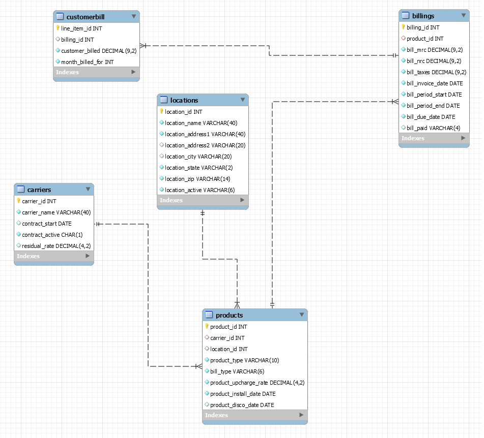

# Using MySQL to create a Database

## Goal of Project

The goal of this project was to create a MySQL database using certain features of MySQL.

- Create multiple views that would only be accessible for certian users.
- Create a stored procedure with some sample scripts to test if it works as expected.
- Create a Trigger so that when data is entered into the database (presumably by a data entry employee) it is automatically "cleaned" so that all formatting is consistant.

Below is an EER diagram of the general layout of the database.

## Overview of Billing Database

The purpose of this database is to create a billing solution for telecommunication clients to see the following:

1. Maintain a record of multiple customer locations.
2. A list of all telecommunications carriers.
3. A products table which combines the above two table to establish the many-to-many relationships.
4. Then the billing table establishes the pulled customer billing and enters the specific bill details.
5. The customer bill table is for when the pulled bill has been paid and is ready to send to the client as one combined bill for the billing month.

### Database Details

MySQL: 8.0.21 _(community edition).
